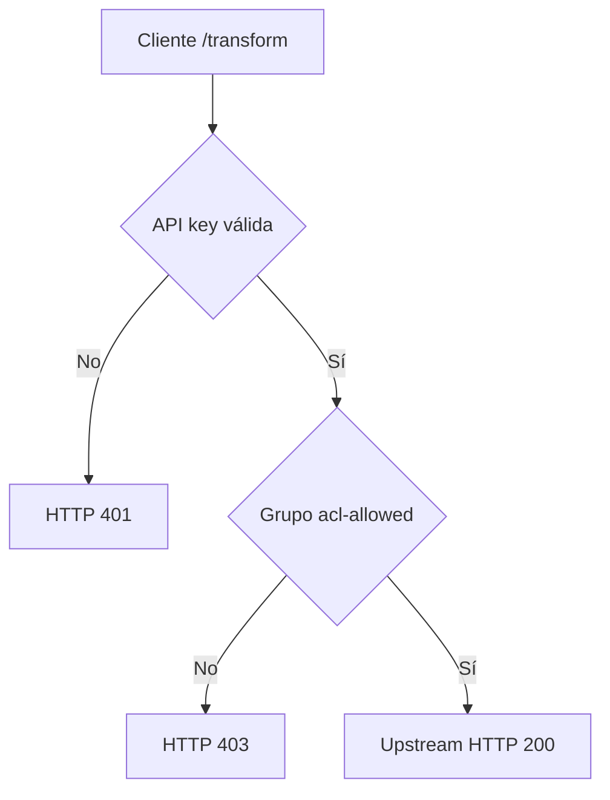
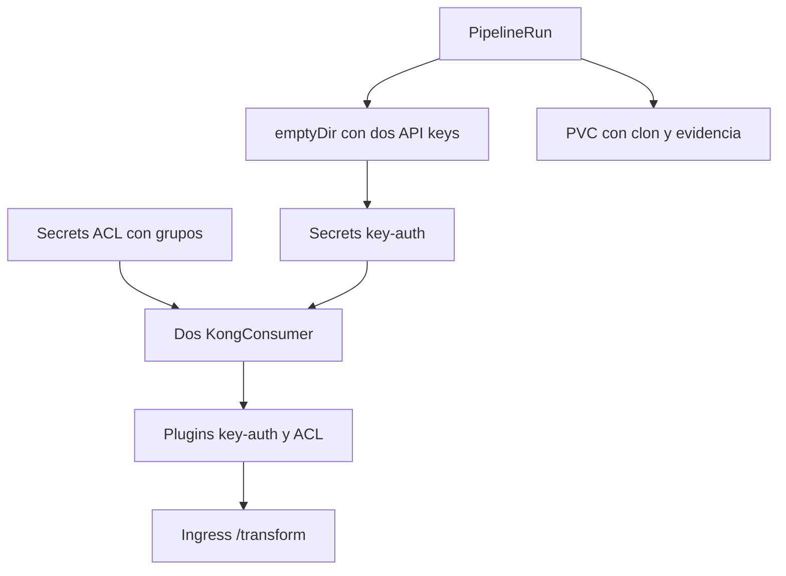

# Flujo: ACL con Key Authentication

`key-auth` se ejecuta antes de ACL: primero identifica al Consumer y después
ACL compara sus grupos con `allow: acl-allowed`. Las claves no llegan al
upstream y `hide_groups_header=true` evita reenviar la membresía.
