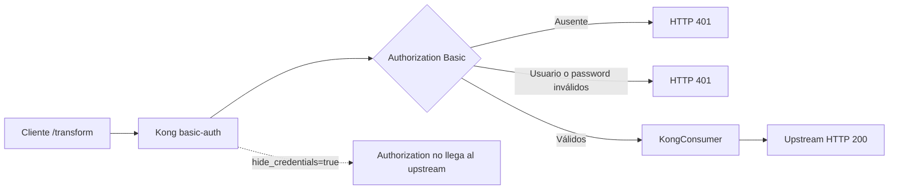
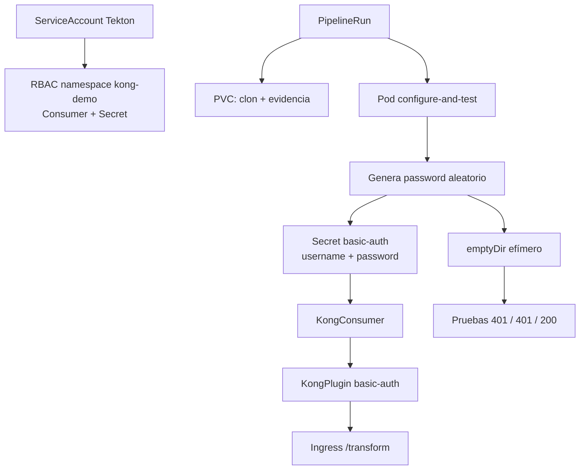

# Flujo: Basic Authentication

Reutiliza el RBAC incorporado para `key-auth`. El PVC nunca contiene la
contraseña; `emptyDir` la comparte dentro del Pod y el Secret la mantiene para
KIC/Kong hasta el rollback. El orden de baja es Ingress, Plugin, Consumer y Secret.
