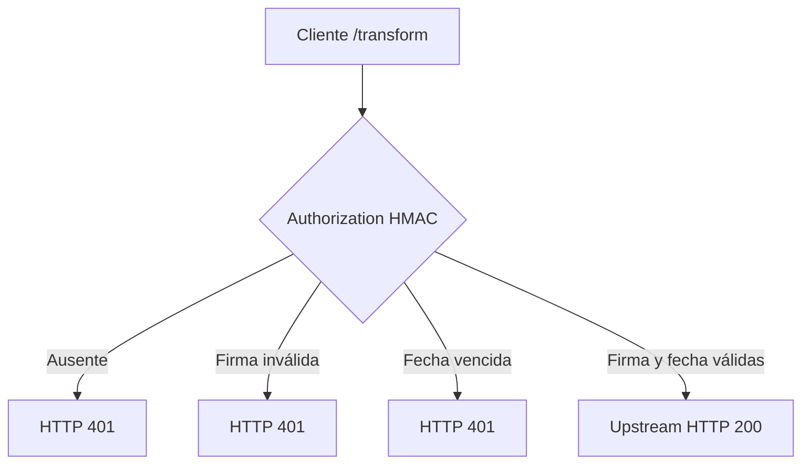
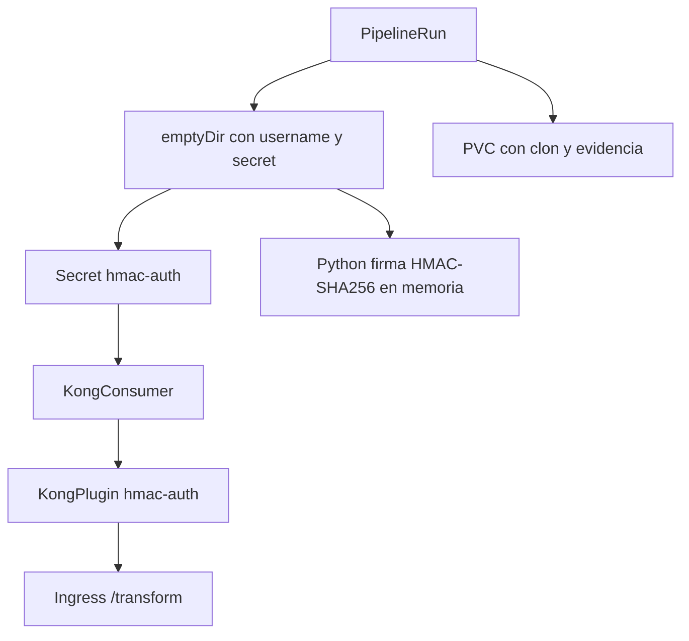

# Flujo: HMAC Authentication

La Pipeline firma únicamente `date`, exige una ventana de 30 segundos y elimina
el material efímero al terminar. `hide_credentials=true` evita que el header
`Authorization` llegue al upstream.
