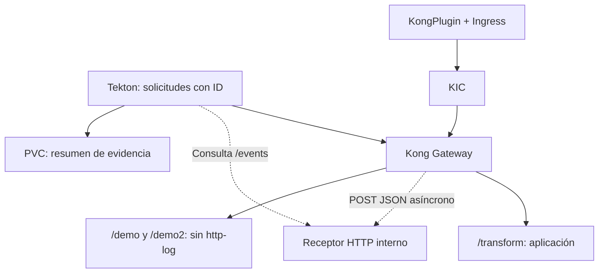

# Flujo: HTTP Log

El receptor no participa en la respuesta al cliente. Su Service ClusterIP y
Deployment están en kong-demo, sin Route pública. KIC es plano de configuración.
Los controles deben responder 200 sin eventos correlacionados durante 45 segundos.
El rollback desasocia el Ingress, elimina demo-http-log y luego el receptor.

- [Mapa Archify](../archify/http-log.architecture.html): descargar/abrir localmente.
- [Guía y rollback](../plugin-tests/http-log.md).
- [Fuente editable](../archify/http-log.architecture.json).
