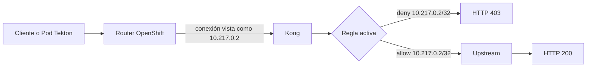
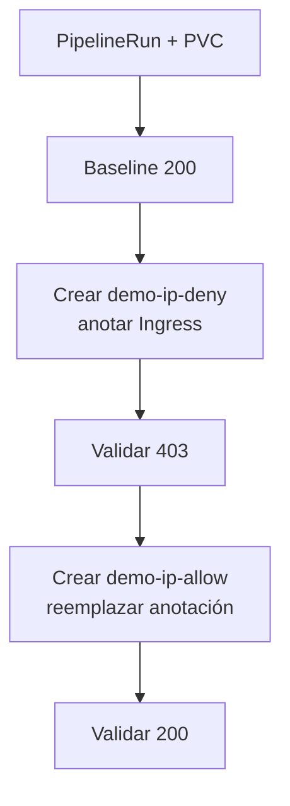

# Flujo: IP Restriction

Usa dos `KongPlugin`, PVC y RBAC para Plugin/Ingress. No usa Consumer, Secret ni
`emptyDir`. El CIDR es específico del recorrido de este CRC; debe descubrirse
nuevamente en otro cluster. El rollback elimina la asociación y ambos CR.
