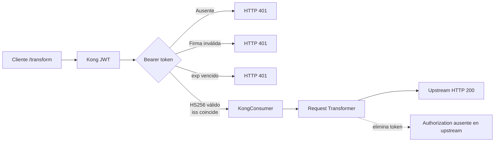
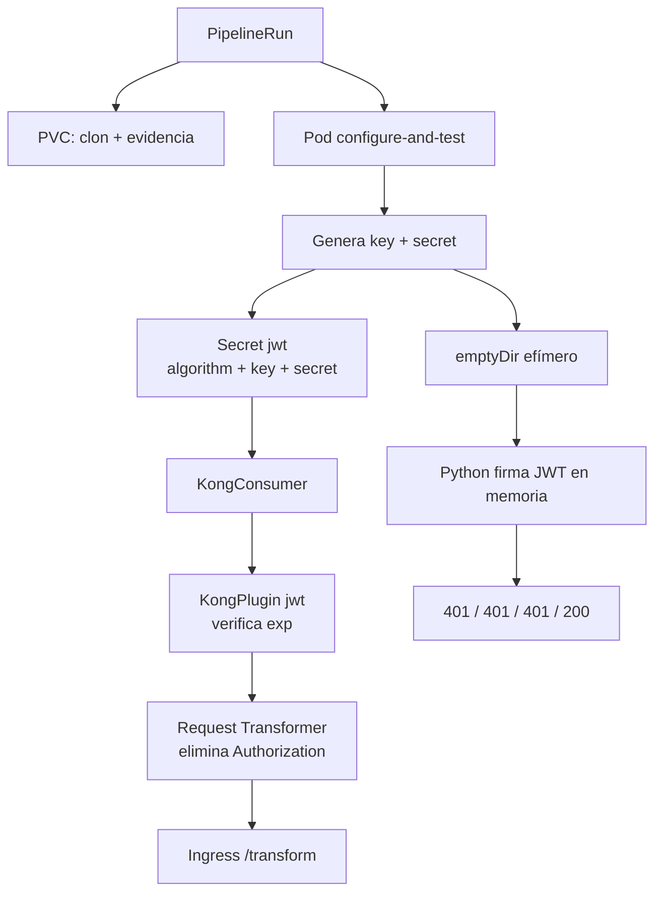

# Flujo: JWT HS256

```mermaid
flowchart LR
  C[Cliente /transform] --> K[Kong JWT]
  K --> T{Bearer token}
  T -->|Ausente| E1[HTTP 401]
  T -->|Firma inválida| E2[HTTP 401]
  T -->|exp vencido| E3[HTTP 401]
  T -->|HS256 válido<br/>iss coincide| CO[KongConsumer]
  CO --> R[Request Transformer]
  R --> U[Upstream HTTP 200]
  R -. elimina token .-> X[Authorization ausente en upstream]
```

```mermaid
flowchart TD
  PR[PipelineRun] --> PVC[PVC: clon + evidencia]
  PR --> POD[Pod configure-and-test]
  POD --> GEN[Genera key + secret]
  GEN --> ED[emptyDir efímero]
  GEN --> SEC[Secret jwt<br/>algorithm + key + secret]
  SEC --> CON[KongConsumer]
  CON --> PL[KongPlugin jwt<br/>verifica exp]
  PL --> RT[Request Transformer<br/>elimina Authorization]
  RT --> ING[Ingress /transform]
  ED --> PY[Python firma JWT en memoria]
  PY --> CASES[401 / 401 / 401 / 200]
```

Reutiliza RBAC para Consumer y Secret. El PVC no contiene material criptográfico;
`emptyDir` comparte la credencial en el Pod y los tokens existen solo en memoria.
