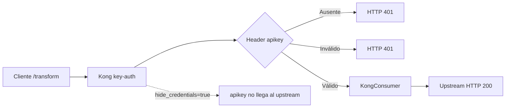
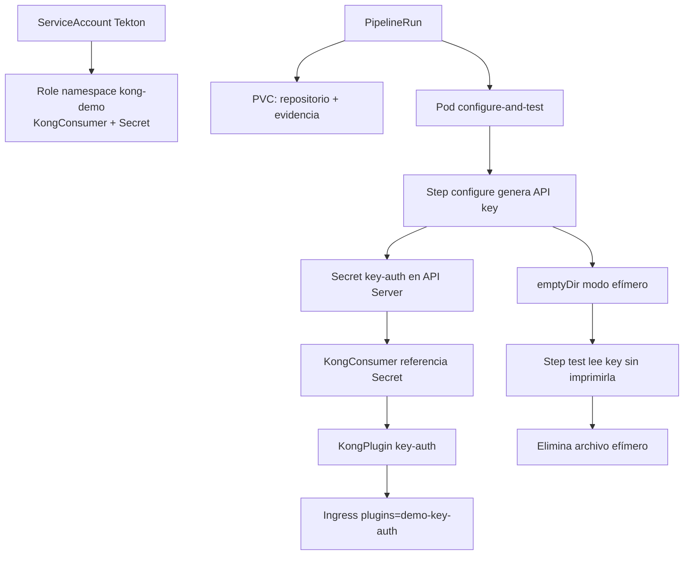
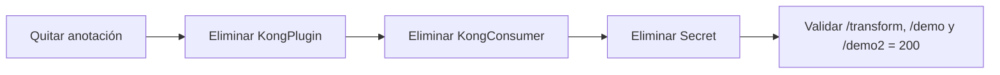

# Flujo: Key Authentication

## Creación segura de la credencial

`key-auth` es la primera prueba que amplía el RBAC para `KongConsumer` y Secret.
El PVC no contiene la clave; solamente conserva el clon y evidencia no sensible.
El `emptyDir` comparte la clave entre Steps del mismo Pod y desaparece con él.
El Secret persiste hasta el rollback para que KIC/Kong puedan autenticar.

## Rollback

El orden elimina primero el efecto sobre el tráfico y después las dependencias.
La eliminación del Secret borra definitivamente la API key del cluster.
