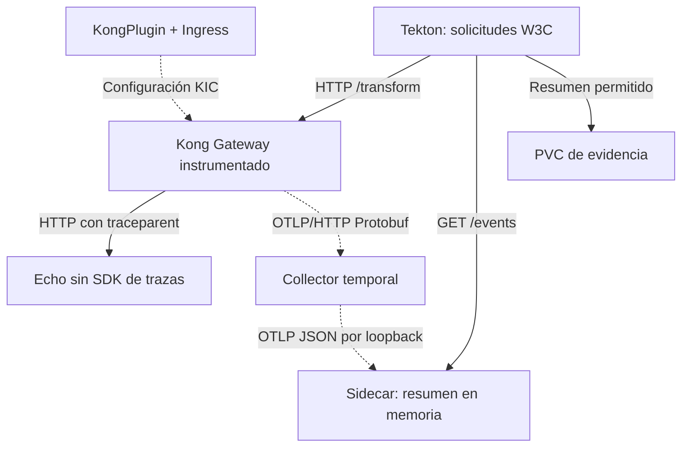

# Flujo: OpenTelemetry

Estado: preparado; pendiente de ejecutar y validar en CRC.

El plugin se asocia solamente a `/transform`; `/demo` y `/demo2` son controles.
La instrumentación temporal `all` y el muestreo `1.0` afectan al Gateway, pero
la exportación se configura por Ingress. La prueba verifica spans de Kong y
`kong.balancer`, no spans internos de la aplicación ni un panel de visualización.

- [Guía y rollback](../plugin-tests/opentelemetry.md).
- [Mapa Archify](../archify/opentelemetry.architecture.html).
- [Fuente Archify](../archify/opentelemetry.architecture.json).
