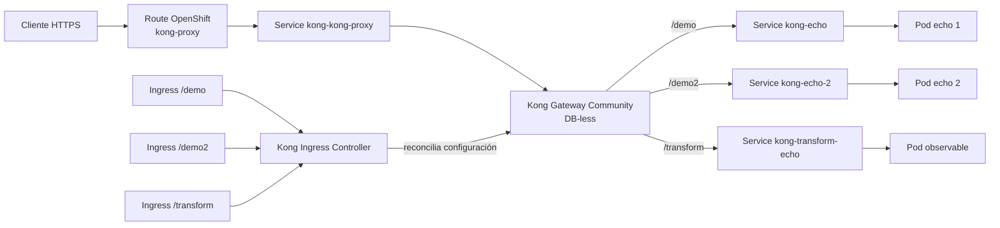
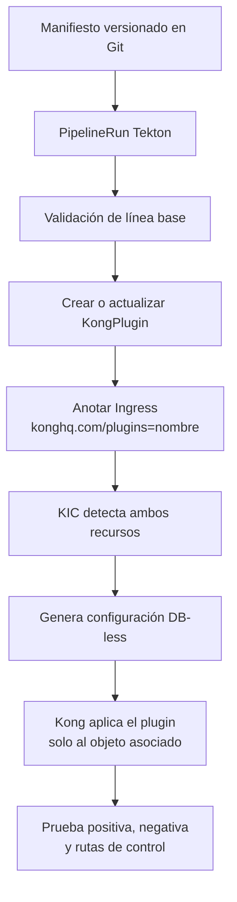
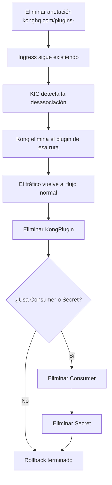
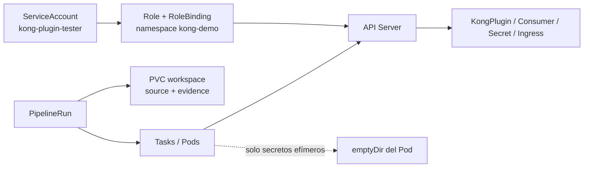

# Plataforma y ciclo de vida de un plugin

## Recorrido de una solicitud

El backend no se conecta activamente con Kong. El Ingress declara la ruta y el
Service destino; KIC observa esa declaración y configura Kong.

## Qué ocurre al agregar un plugin

El `KongPlugin` contiene la configuración. La anotación del Ingress es la
asociación que lo activa para esa ruta. Crear el CR sin anotarlo no modifica el
tráfico del Ingress.

## Qué ocurre al quitar un plugin

El sufijo `-` en `konghq.com/plugins-` elimina únicamente la anotación. No
elimina el Ingress, su path, Service, Deployment ni Pod. `strip-path=true`
permanece y Kong continúa quitando el prefijo antes de llamar al backend.

## Recursos de la automatización

- El RBAC autoriza a Tekton; no modifica el tráfico por sí mismo.
- El PVC comparte archivos entre Tasks y conserva evidencia del PipelineRun.
- `emptyDir` vive mientras existe el Pod y no se comparte con otros Pods.
- Kong continúa DB-less: los CR Kubernetes son la fuente observada por KIC.
