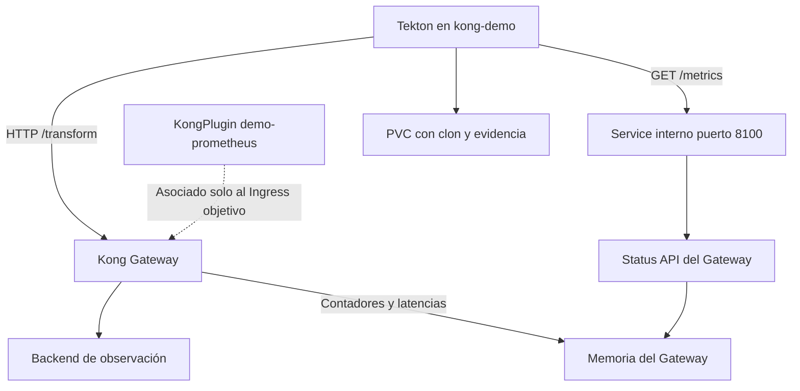

# Flujo: Prometheus

El Service `kong-lab-prometheus-metrics` vive en `kong` y se instala manualmente.
Tekton no recibe permisos de escritura en ese namespace. No se crea Route,
Prometheus Server, Grafana, Consumer ni Secret.

Las solicitudes a `/demo` y `/demo2` siguen respondiendo 200, pero no deben
incrementar las métricas HTTP/latencias por ruta del plugin. Las métricas
generales de Nginx sí pueden cambiar con cualquier tráfico.

[Guía de ejecución y rollback](../plugin-tests/prometheus.md).
