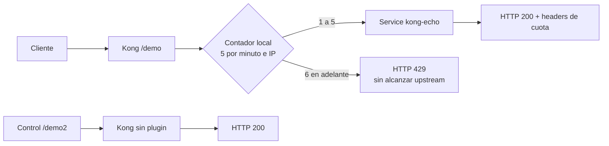
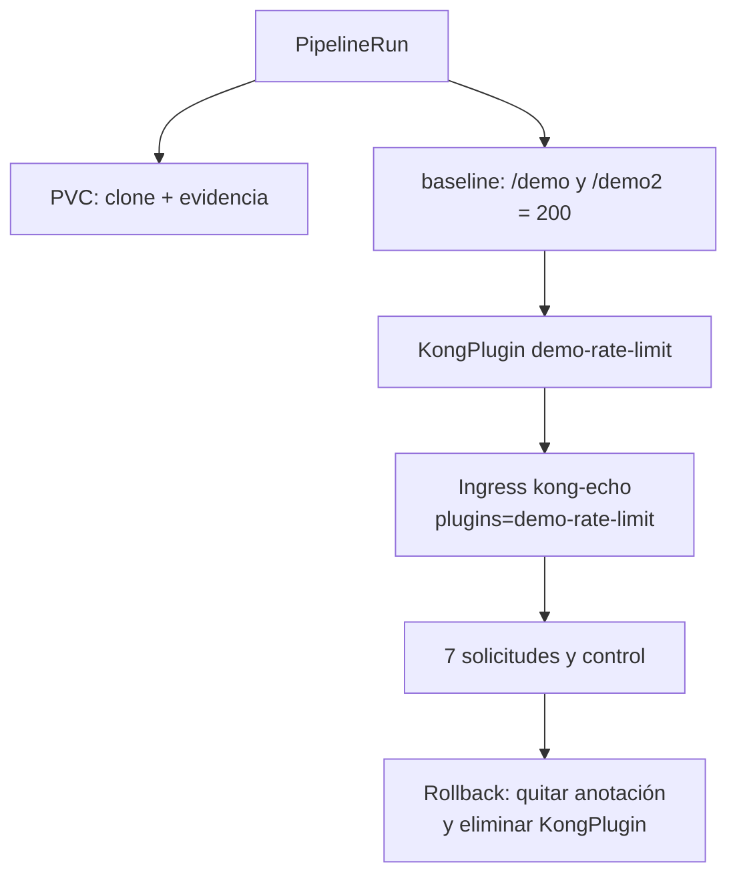

# Flujo: Rate Limiting

```mermaid
flowchart LR
  C[Cliente] --> K[Kong /demo]
  K --> R{Contador local<br/>5 por minuto e IP}
  R -->|1 a 5| S[Service kong-echo]
  S --> OK[HTTP 200 + headers de cuota]
  R -->|6 en adelante| RL[HTTP 429<br/>sin alcanzar upstream]
  C2[Control /demo2] --> K2[Kong sin plugin] --> OK2[HTTP 200]
```

```mermaid
flowchart TD
  P[PipelineRun] --> PVC[PVC: clone + evidencia]
  P --> B[baseline: /demo y /demo2 = 200]
  B --> KP[KongPlugin demo-rate-limit]
  KP --> I[Ingress kong-echo<br/>plugins=demo-rate-limit]
  I --> T[7 solicitudes y control]
  T --> RB[Rollback: quitar anotación<br/>y eliminar KongPlugin]
```

Necesita RBAC para `KongPlugin` e Ingress y un PVC Tekton. No necesita Consumer,
Secret ni `emptyDir`. `policy: local` mantiene el contador en la réplica Kong.
