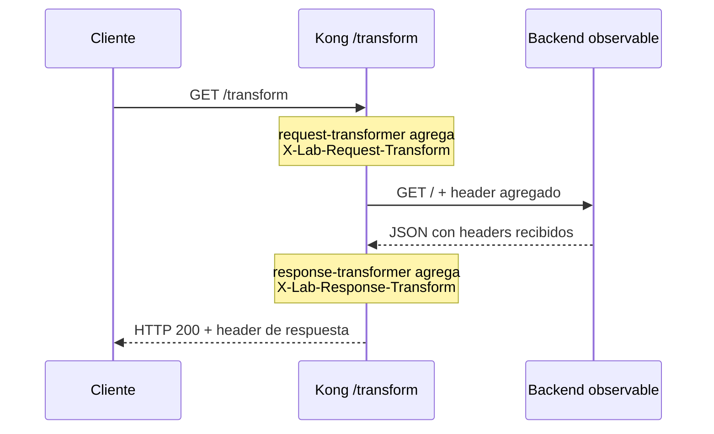
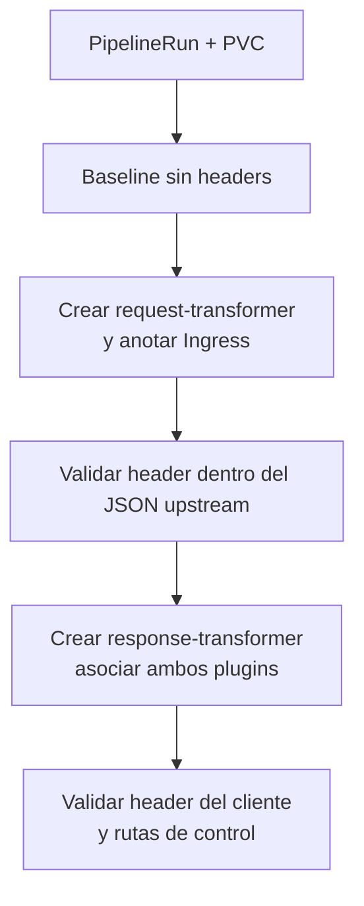

# Flujo: Request y Response Transformers

Usa dos `KongPlugin`, RBAC de Plugin/Ingress y PVC. No usa Secret, Consumer ni
`emptyDir`. El backend observable es necesario para demostrar la transformación
de la solicitud. El rollback desasocia ambos plugins y conserva la aplicación.
